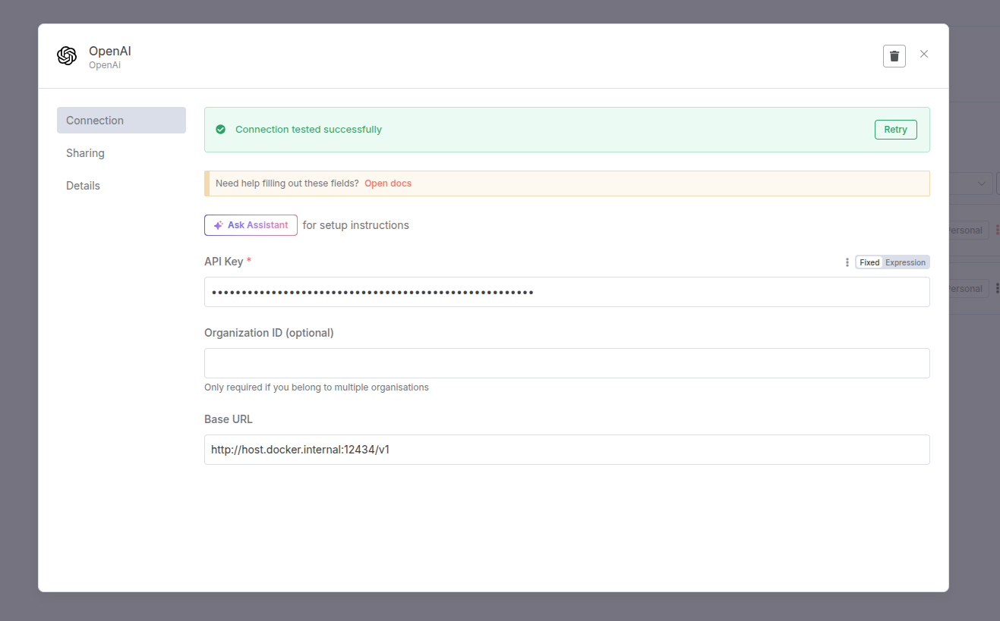
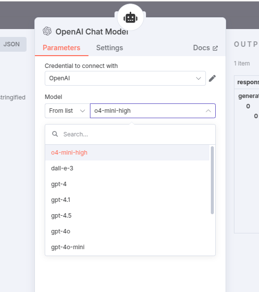
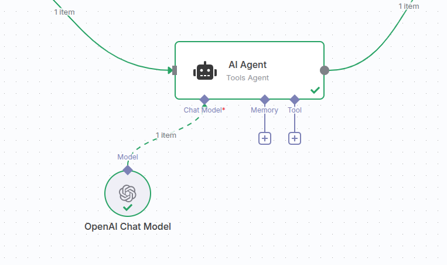

<p align="center">
  <a href="http://nestjs.com/" target="blank"></a>
</p>

An LLM-Proxy for [Gpt4Free](https://github.com/xtekky/gpt4free) service to expose one single provider over the API.

## Configuration

* Proxmox

  Run this script in your Proxmox host shell
  
  ```bash
  bash -c "$(curl -fsSL https://raw.githubusercontent.com/BennyExtreme/n8n-g4f-proxy/refs/heads/master/proxmox.sh)"
  ```

* Docker

  The basic `docker-compose` configuration is below:
  
  ```bash
    ...
  
    g4f:
      image: hlohaus789/g4f:latest
      shm_size: 2g
      volumes:
        # see instructions from g4f repo on the setup.
        - ./har_and_cookies:/app/har_and_cookies
        - ./generated_media:/app/generated_media
  
    llm-proxy-openai:
      image: ghcr.io/korotovsky/n8n-g4f-proxy:latest
      ports:
        - "12434:3000" # port 12434 become accessible on host via host.docker.internal:12434 in the credentials popup
      environment:
        - LLM_PROXY_PROVIDER=OpenaiChat # choose the provider from /v1/providers
        - LLM_UPSTREAM=http://g4f:8080
  
    ...
  ```

As an initial step you must create credential for LLM-proxy



Now you can use the limited sub-set of models in your n8n andmake sure your AI Agent requests will be routed always via specified provider.



Example of connection:



## License

Nest is [MIT licensed](https://github.com/nestjs/nest/blob/master/LICENSE).
